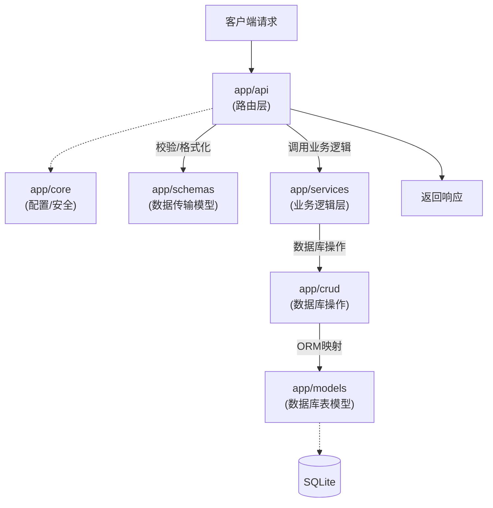

# NayukiBlog

一个基于 Astro + FastAPI + SQLite 的现代化博客系统。

## 🚀 技术栈

- **前端**: [Astro](https://astro.build/) - 静态站点生成与动态组件
- **后端**: [FastAPI](https://fastapi.tiangolo.com/) - 高性能 Python Web 框架
- **数据库**: SQLite - 轻量级关系型数据库
- **样式**: CSS Modules / Global CSS

## 📂 项目结构

```
blog-project
├── backend/          # FastAPI 后端
│   ├── app/          # 应用核心代码
│   ├── db/           # 数据库配置与迁移
│   └── requirements.txt
├── frontend/         # Astro 前端
│   ├── src/
│   │   ├── components/ # UI 组件
│   │   ├── layouts/    # 页面布局
│   │   └── pages/      # 路由页面
│   └── astro.config.mjs
└── README.md
```

## 🛠️ 快速开始

### 前端 (Frontend)

```bash
cd frontend
npm install
npm run dev
```

### 后端 (Backend)

```bash
cd backend
pip install -r requirements.txt
uvicorn app.main:app --reload
```

## ✨ 特性

- ⚡️ 极速的页面加载 (Astro)
- 🔒 类型安全的开发体验 (TypeScript + Pydantic)
- 📝 Markdown 博客撰写支持
- 🎨 响应式设计

## 系统架构

### 后端模块交互 (app 文件夹结构)

展示了 `app` 目录下各子文件夹如何协同工作处理请求：



### `app` 目录详细说明

- **`api` (路由层)**: 定义 API 接口的 URL 路径和 HTTP 方法。负责接收请求、解析参数、调用 Service 层处理业务，并返回响应。
- **`core` (核心配置)**: 存放项目的核心组件。包括全局配置（如数据库 URL、密钥）、安全认证逻辑（如 JWT 处理）、以及全局异常处理等。
- **`schemas` (数据模型)**: 基于 Pydantic 的数据传输对象。定义请求体和响应体的结构，负责数据的自动校验和序列化/反序列化。
- **`services` (业务逻辑)**: 处理核心业务规则。它从 API 层接收指令，可能需要组合多个 CRUD 操作或执行复杂计算，保持 API 层简洁。
- **`crud` (数据操作)**: 封装数据库的基本增删改查操作。直接使用 Session 与数据库交互，只关注数据存取，不包含复杂业务逻辑。
- **`models` (数据库表)**: 基于 SQLAlchemy 的 ORM 模型。定义数据库表的结构、字段类型以及表之间的关联关系。

### API 请求全流程示例 (以创建文章为例)

当用户发起一个请求时，数据在系统中的流转过程如下：

1.  **请求到达 (API Layer)**
    - 用户发送 `POST /posts/` 请求，Body 中包含文章标题和内容。
    - `app/api/endpoints/posts.py` 中的路由函数接收请求。

2.  **数据校验 (Schemas Layer)**
    - FastAPI 自动使用 `app/schemas/post.py` 中的 `PostCreate` 模型校验 JSON 数据（例如：检查必填字段、数据类型）。

3.  **业务处理 (Services Layer)**
    - 校验通过后，API 层调用 `app/services/post_service.py`。
    - Service 层执行业务逻辑（例如：处理标签逻辑、生成摘要、检查用户权限）。

4.  **数据库操作 (CRUD Layer)**
    - Service 层调用 `app/crud/post.py`。
    - CRUD 层将 Pydantic 数据对象转换为 SQLAlchemy 模型对象 (`app/models/post.py`)，并添加到数据库会话中。

5.  **持久化 (Database)**
    - SQLAlchemy 执行 `INSERT` SQL 语句，将数据写入 SQLite 数据库。

6.  **响应返回**
    - 数据库返回新创建的记录对象。
    - 数据沿调用链返回：CRUD -> Service -> API。
    - API 层使用 `PostResponse` schema 将数据库模型对象序列化为 JSON 格式，并返回给客户端。
